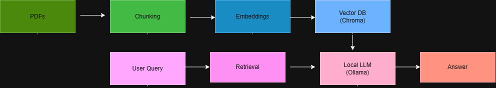
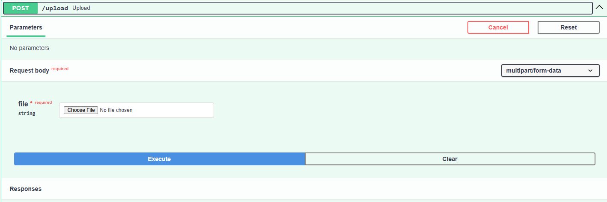
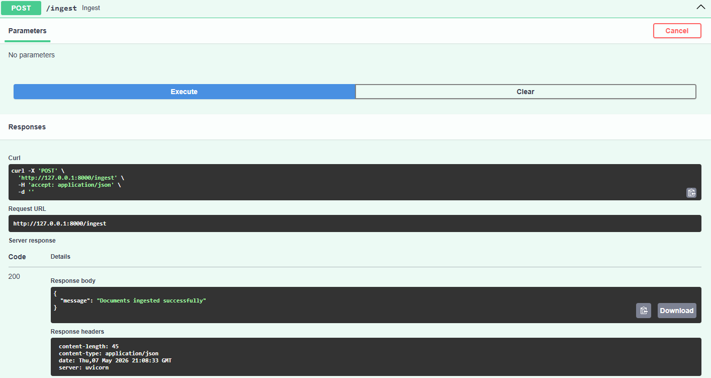
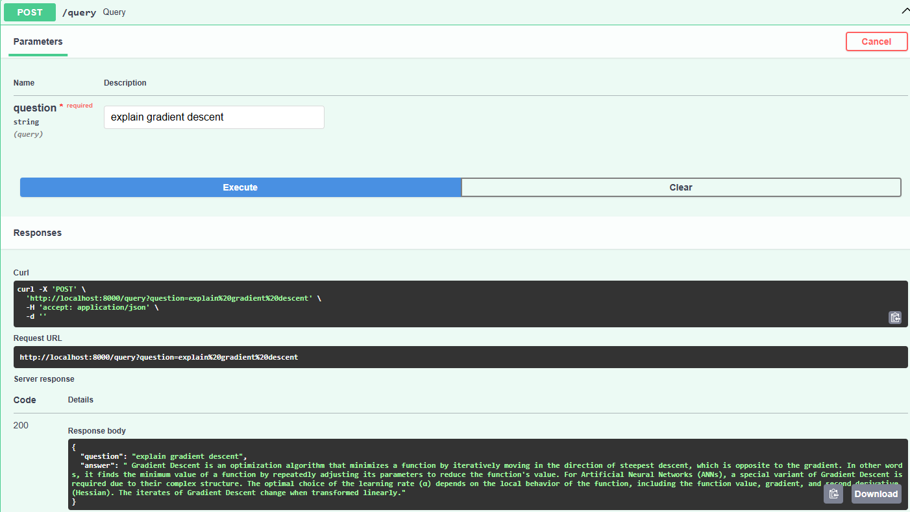

# RAG AI Assistant for Technical Documents

An end-to-end **Retrieval-Augmented Generation (RAG)** system that allows users to upload PDFs and query them using a fully local AI pipeline.

---

## 🚀 Features

* 📄 Upload and process multiple PDF documents
* 🔍 Semantic search using vector embeddings
* 🤖 Context-aware question answering
* ⚡ FastAPI backend with REST endpoints
* 🐳 Dockerized for easy deployment
* 🖥️ Fully local (no API costs)

---

## 🏗️ Architecture



---

## 🛠️ Tech Stack

* **Backend:** FastAPI
* **LLM:** Ollama (Mistral / LLaMA3)
* **Embeddings:** HuggingFace (MiniLM)
* **Vector DB:** Chroma
* **Framework:** LangChain
* **Containerization:** Docker

---

## 📁 Project Structure

```bash
rag-ai-assistant/
│
├── app/
│   ├── main.py          # FastAPI app
│   ├── rag/
│   │   ├── ingest.py    # PDF ingestion pipeline
│   │   └── query.py     # RAG query pipeline
│
├── docs/                # Screenshots & architecture images
├── data/                # Uploaded PDFs
├── db/                  # Vector database
├── Dockerfile
├── docker-compose.yml
├── requirements.txt
├── .env.example
└── README.md
```

---

## ⚙️ Setup (Local)

### 1. Clone repo

```bash
git clone https://github.com/yourusername/rag-ai-assistant.git
cd rag-ai-assistant
```

### 2. Create environment

```bash
python -m venv venv
```

Activate environment:

**Windows**
```bash
venv\Scripts\activate
```

**Linux / Mac**
```bash
source venv/bin/activate
```

### 3. Install dependencies

```bash
pip install -r requirements.txt
```

### 4. Run API

```bash
uvicorn app.main:app --reload
```

API available at:

```bash
http://localhost:8000/docs
```

---

## 🐳 Run with Docker

### Start Docker Desktop first

Then run:

```bash
docker compose up --build
```

API available at:

```bash
http://localhost:8000/docs
```

---

## 🧠 Local LLM Setup (Ollama)

Install Ollama and pull a model:

```bash
ollama pull mistral
```

Check installed models:

```bash
ollama list
```

Ensure Ollama is running before querying documents.

---

# 📡 API Endpoints

---

## 🔹 Upload PDF

Upload technical documents to the system.

### Endpoint

```http
POST /upload
```

### Example



---

## 🔹 Ingest Documents

Processes uploaded PDFs into chunks and stores embeddings inside ChromaDB.

### Endpoint

```http
POST /ingest
```

### Example



---

## 🔹 Query Documents

Ask questions about uploaded documents using Retrieval-Augmented Generation.

### Endpoint

```http
POST /query
```

### Example



---

## 💡 How the Pipeline Works

1. PDFs are uploaded through the `/upload` endpoint
2. Documents are chunked and converted into embeddings
3. Embeddings are stored inside ChromaDB
4. Relevant chunks are retrieved during querying
5. Ollama + Mistral generates grounded responses using retrieved context

---

## ✨ Key Highlights

* Designed a **scalable RAG pipeline** for document understanding
* Implemented **hallucination control** using retrieval context
* Built a **fully local AI stack** with Ollama + HuggingFace
* Dockerized the application for reproducibility and deployment
* Implemented semantic search with vector embeddings

---

## 🚀 Future Improvements

* Streamlit frontend
* Authentication & user sessions
* Full multi-container setup (API + Ollama)
* GPU acceleration
* Conversation memory
* Hybrid search (keyword + semantic)

---

## 👤 Author

**Marco Antonio Barrera Salas**  
Data Engineer | Data Scientist

* [LinkedIn](https://www.linkedin.com/in/marcobarrera98/)
* [GitHub](https://github.com/MarcoABarrera)

---

## ⭐ If you like this project

Give it a star ⭐ and feel free to contribute!